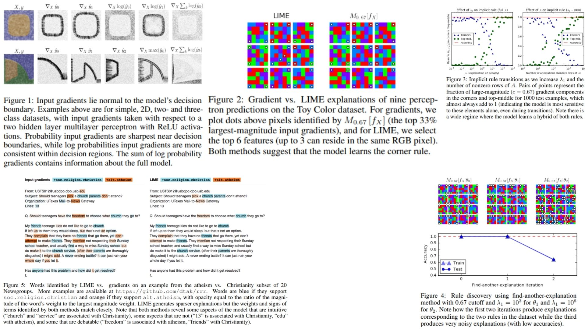

# 🧠 Right-Reasons-Replication — Training Models for the Right Reasons

This repository provides a **PyTorch-based research replication** of  
**Right for the Right Reasons: Training Differentiable Models by Constraining their Explanations — Ross et al., 2017**.

The project focuses on **faithfully translating the paper’s mathematical formulation and reasoning framework into clean, modular, and inspectable code** — without relying on dataset training or benchmarking.

- Enforces **human-defined reasoning constraints** 🧬  
- Penalizes **spurious correlations via input-gradient regularization** 🩻  
- Forces models to learn **robust, causal decision rules** 🧠  

**Paper reference:**  
[Right for the Right Reasons: Training Differentiable Models by Constraining their Explanations — Ross et al., 2017](https://arxiv.org/abs/1703.03717) 📄

---

## 🧬 Overview — Right for the Right Reasons Pipeline



The core idea:

> Accuracy alone is not enough.  
> A model must be correct **for the correct reasons**.

Instead of optimizing only prediction accuracy, the model is trained under **explanation constraints** that suppress forbidden reasoning paths.

Rather than learning:

$$
x \longrightarrow y
$$

We enforce:

$$
x \longrightarrow y \quad \text{subject to} \quad \nabla_x \hat{y} \;\bot\; \text{forbidden features}
$$

Meaning:  
the model may see all inputs, but is **not allowed to rely on certain features** when forming its decision.

---

## 🔬 Mathematical Formulation

Let a differentiable model $f_\theta$ produce predictions:

$$
\hat{y} = f_\theta(x)
$$

We define an **annotation matrix**:

$$
A \in \{0,1\}^{N \times D}
$$

Where:
- $N$ = number of samples  
- $D$ = number of features  
- $A_{nd} = 1$ indicates feature $d$ is **forbidden** for sample $n$

We penalize gradients flowing through forbidden features.

The total loss is:

```math
\mathcal{L}(\theta) =
\sum_{n,k} -y_{nk}\log \hat{y}_{nk}
+ \lambda_1 \sum_{n,d} A_{nd}
\left(
\frac{\partial}{\partial x_{nd}}
\sum_k \log \hat{y}_{nk}
\right)^2
+ \lambda_2 \sum_i \theta_i^2
```

Where:
- First term → **Right answers**  
- Second term → **Right reasons** (gradient suppression)  
- Third term → Weight regularization  

This forces the model to find **alternative decision rules** that do not depend on forbidden features.

---

## 🧩 What the Model Learns

- To avoid shortcut learning  
- To suppress spurious correlations  
- To ignore confounding signals  
- To discover robust causal features  
- To reason through allowed evidence only  

In effect, we explicitly constrain the model to base its decisions only on causally valid evidence.

---

## 📦 Repository Structure

```bash
Right-Reasons-Replication/
├── src/
│   ├── backbone/
│   │   └── encoder.py              # Input → Feature embedding (MLP / CNN / Transformer)
│   │
│   ├── explanation/
│   │   ├── gradient_explainer.py   # Input → ∂y/∂x  (input-gradient computation)
│   │   ├── mask_generator.py       # Annotation matrix A generation or loading
│   │   └── explanation_loss.py     # Right-reason penalty computation
│   │
│   ├── model/
│   │   └── reasoning_model.py      # Feature → Prediction (main classifier)
│   │
│   ├── pipeline/
│   │   └── forward_pipeline.py     # Input → Model → Gradient → Constraint → Loss
│   │
│   ├── loss/
│   │   └── total_loss.py           # Right answer + Right reason + Regularization
│   │
│   ├── utils/
│   │   └── sanity_checks.py        # Verifies forbidden gradients are suppressed
│   │
│   └── config.py                  # λ1, λ2, model size, explanation settings
│
├── images/
│   └── figmix.jpg                 # Pipeline + geometry visualization
│
├── requirements.txt
└── README.md
```
---


## 🔗 Feedback

For questions or feedback, contact: [barkin.adiguzel@gmail.com](mailto:barkin.adiguzel@gmail.com)
